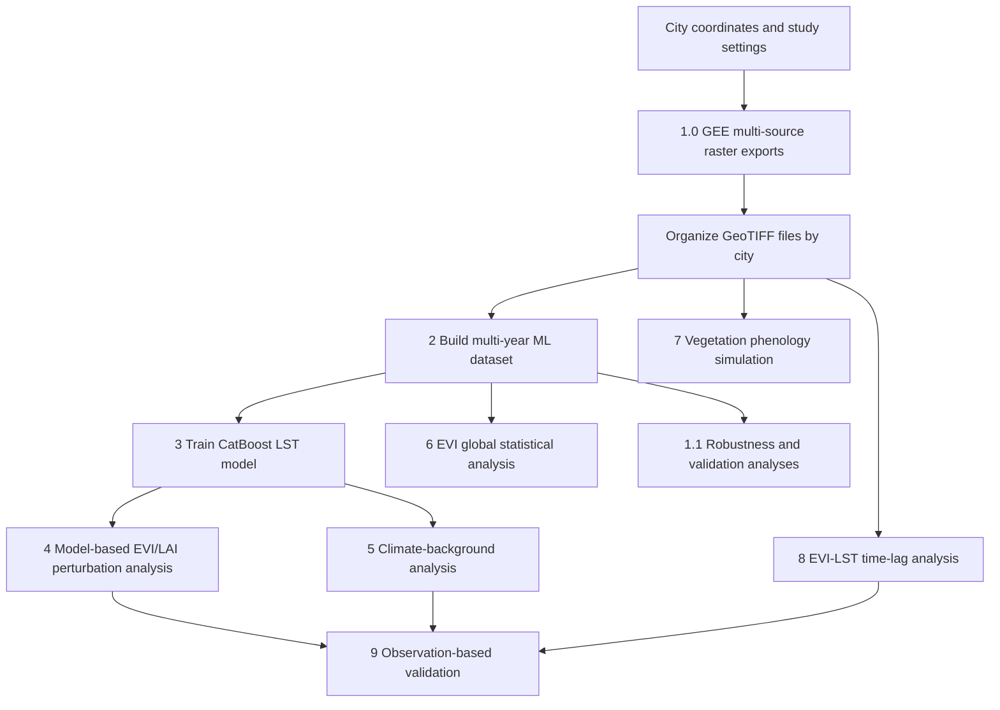

# Urban Vegetation Cooling Depends on Marginal Greenness Returns

This repository contains the main code used for the study **"Urban vegetation cooling depends on marginal greenness returns"**.

The workflow combines Google Earth Engine exports, multi-source raster harmonization, CatBoost modelling, model-based perturbation analysis, climate-background analysis, EVI statistical diagnostics, vegetation phenology simulation, EVI-LST time-lag analysis, robustness checks, and observation-based validation.

This project is a **Google Earth Engine + Google Colab/Python** workflow. It is not a packaged Python library and is not intended to be installed with `pip install`.

## Research Questions

The central research questions are:

1. How does urban vegetation cooling respond to marginal increases in greenness?
2. Do EVI and LAI show nonlinear or diminishing marginal cooling returns?
3. How do climatic backgrounds regulate vegetation cooling responses?
4. How do vegetation phenology and EVI-LST timing affect urban thermal conditions?
5. Can model-implied vegetation cooling responses be validated using observation-based benchmarks?

The analysis focuses on globally distributed cities over **2013-2025**. It uses remote-sensing and climate datasets including MODIS, ERA5-Land, VIIRS night-time lights, land cover, terrain data, and Koppen-Geiger climate-zone information. A CatBoost model is trained to predict daytime land surface temperature (LST), and perturbation experiments are then used to quantify the cooling response of LST to vegetation greenness and canopy structure, represented mainly by EVI and LAI.

## Repository Contents

| File | Environment | Purpose | Typical outputs |
|---|---|---|---|
| `1.0 GEE obtain origin data` | Google Earth Engine Code Editor | Exports city-level raster stacks for land cover, DEM, LST, EVI, LAI, night-time lights, and ERA5-Land variables | GeoTIFF files for each city and year |
| `1.1.Robustness and validation analyses` | Colab / Python | Performs spatial autocorrelation diagnostics and related robustness or validation analyses | CSV files and diagnostic figures |
| `2. Constructing the Dataset` | Colab / Python | Converts city-level multi-band GeoTIFF files into a multi-year machine-learning dataset with sample-level metadata | `ALLCITIES_train_xy_*.npz`, sampling reports, city cache files |
| `3. CAT training dataset` | Colab / Python | Trains the CatBoost LST prediction model and saves validation data and model outputs | CatBoost model, feature names, validation arrays, metrics |
| `4. Model-based perturbation analysis` | Colab / Python | Applies EVI/LAI perturbations to quantify model-implied vegetation cooling responses | Perturbation-result tables and figures |
| `5. Analysis of the Influence of Climatic Factors on Vegetation Cooling` | Colab / Python | Evaluates vegetation cooling responses under different climatic backgrounds | Climate-stratified cooling-response results and figures |
| `6. EVI Global Statistical Analysis` | Colab / Python | Computes global sample-level and city-level EVI statistics | EVI statistics tables and diagnostic plots |
| `7. Simulation of Vegetation Phenology Effects on LST` | Colab / Python | Builds typical vegetation/LST seasonal trajectories and simulates phenology effects on LST | Seasonal time-series CSV files and simulation outputs |
| `8. Time Lag Calculation and Global Analysis` | Colab / Python | Assigns Koppen-Geiger climate classes and analyzes EVI-LST timing relationships | Koppen metadata, lag summaries, global analysis outputs |
| `9. validating model-implied vegetation cooling responses` | Colab / Python | Validates model-implied cooling responses using matched observational benchmarks | Observation-based benchmark tables and validation figures |

## Workflow Overview



The recommended order is to run the scripts by file number. File `1.0` exports the original remote-sensing data. File `2` constructs the machine-learning dataset. File `3` trains the core CatBoost model. Files `4-5` produce the main model-based vegetation cooling analyses. Files `6-8` support global EVI statistics, phenology simulation, and time-lag diagnostics. Files `1.1` and `9` are mainly used for robustness checks and validation.

## Environment

### Google Earth Engine

`1.0 GEE obtain origin data` must be run in the Google Earth Engine Code Editor.

Each export block defines city-level parameters such as:

```javascript
var CITY_NAME       = 'MexicoCityLaLaguna';
var CITY_LON        = -99.1061;
var CITY_LAT        = 19.46855;
var CITY_BUFFER_KM  = 80;
var START_YEAR      = 2013;
var END_YEAR        = 2025;
var EXPORT_CRS      = 'EPSG:4326';
var DEG_PER_PIXEL   = 0.005;
```

Run one export block at a time, check the city parameters, and start the export task from the GEE Tasks panel.

### Python / Google Colab

Most Python scripts were written in Google Colab style. Some scripts use `/content/drive/MyDrive/...` paths and may include notebook-style installation commands.

If running in Colab, mount Google Drive first:

```python
from google.colab import drive
drive.mount("/content/drive")
```

Recommended dependencies:

```bash
pip install numpy pandas rasterio tqdm catboost scikit-learn matplotlib scipy statsmodels openpyxl pyproj shap
```

Some analyses may also require additional plotting or geospatial packages depending on the section being run.

## Suggested Data Directory Structure

The scripts generally assume that exported GeoTIFF files are organized by city under a Google Drive root directory such as:

```text
/content/drive/MyDrive/anature_revised/
  data/
    CityName/
      *.tif
      *.tiff
    AnotherCity/
      *.tif
      *.tiff
  Koppen_data/
    1991_2020/
      *.tif
  selected_cities_fullinfo_with_koppen.xlsx
```

The main dataset-construction script uses:

```python
ROOT = "/content/drive/MyDrive/anature_revised/data"
CITY_INFO = "/content/drive/MyDrive/anature_revised/selected_cities_fullinfo_with_koppen.xlsx"
```

If your data are stored elsewhere, update `ROOT`, `CITY_INFO`, `DATA_PATH`, `MODEL_PATH`, `OUT_DIR`, and other path variables at the top of each script.

## Step 1: Export Original Data from Google Earth Engine

Open `1.0 GEE obtain origin data` in the Google Earth Engine Code Editor.

The script exports multi-source raster data for each city, including:

| Data type | Example source / variable | Notes |
|---|---|---|
| Land cover | MODIS land cover | Used for land/water filtering and urban context |
| LST | MODIS land surface temperature | Daytime LST is used as the target variable |
| EVI | MODIS vegetation index | Main greenness predictor |
| LAI | MODIS leaf area index | Canopy-structure predictor |
| Night-time lights | VIIRS | Used as an urban-intensity indicator |
| ERA5-Land | Temperature, humidity, radiation, precipitation, soil moisture, wind, soil temperature | Climate-background predictors |
| DEM / terrain | Elevation and related terrain variables | Static topographic predictors |

After exporting, place all GeoTIFF files under:

```text
/content/drive/MyDrive/anature_revised/data/<city_name>/
```

## Step 2: Construct the Multi-Year Dataset

Run:

```text
2. Constructing the Dataset
```

This script scans city folders, reads multi-band GeoTIFF files, harmonizes raster grids, applies masking and sampling rules, and builds a machine-learning matrix.

Important settings include:

```python
YEAR_START = 2013
YEAR_END = 2025
FINE_DEG = 0.005
ERA_DEG = 0.10
CITY_LIMIT = 100
MAX_SAMPLES_PER_CITY_MONTH = 3000
TARGET_PREFS = ("LST.LSTD", "LST.LST_DAY", "LST_DAY")
EXCLUDE_LST_FEATURES = True
```

The script saves sample-level metadata, including city, year, month, coordinates, row/column positions, ERA5 grid positions, and spatial block IDs.

Typical outputs include:

```text
ALLCITIES_train_xy_MULTIYEAR_2013_2025_*.npz
city_cache_npz/
sampling reports
metadata tables
```

The NPZ dataset typically contains:

| Field | Meaning |
|---|---|
| `X` | Feature matrix |
| `y` | Daytime LST target |
| `channels` | Feature names |
| `sample_city_id` | City identifier for each sample |
| `sample_city_name` | City name for each sample |
| `sample_year` | Year for each sample |
| `sample_month` | Month for each sample |
| `sample_lon`, `sample_lat` | Sample coordinates |
| `sample_row`, `sample_col` | Fine-grid pixel positions |
| `sample_era_row`, `sample_era_col` | ERA5-scale grid positions |
| `sample_spatial_block_id` | Spatial block identifier |

## Step 3: Train the CatBoost Model

Run:

```text
3. CAT training dataset
```

Set `DATA_PATH` to the NPZ file produced in Step 2:

```python
DATA_PATH = "/content/drive/MyDrive/anature_revised/multiyear_catboost_npz_with_metadata_fast_WITH_SWVL1_WIND10M_STL1/ALLCITIES_train_xy_MULTIYEAR_2013_2025_fine0.005_S1_maxCM3000_TOP100_WITH_ROWCOL_LOCALFAST_WITH_SWVL1_WIND10M_STL1.npz"
```

The script trains a CatBoost regression model to predict daytime LST from vegetation, climate, terrain, land-cover, and urban-background predictors.

Typical outputs include:

```text
catboost_model.cbm
channels.npy
X_valid.npy
y_valid.npy
metrics.json
diagnostic figures
```

## Step 4: Model-Based Perturbation Analysis

Run:

```text
4. Model-based perturbation analysis
```

This script loads the trained CatBoost model and validation data, then applies controlled perturbations to EVI and LAI. The goal is to estimate how marginal changes in greenness or canopy structure affect predicted LST.

The analysis focuses on nonlinear cooling responses and marginal greenness returns.

## Step 5: Climate-Background Analysis

Run:

```text
5. Analysis of the Influence of Climatic Factors on Vegetation Cooling
```

This script evaluates how vegetation cooling responses vary under different climatic conditions, such as thermal, moisture, radiation, and atmospheric backgrounds.

## Step 6: EVI Global Statistical Analysis

Run:

```text
6. EVI Global Statistical Analysis
```

This script summarizes EVI distributions across samples and cities. It can be used to compare observed urban greenness levels with greenness ranges associated with stronger or weaker model-implied cooling responses.

## Step 7: Simulate Vegetation Phenology Effects on LST

Run:

```text
7. Simulation of Vegetation Phenology Effects on LST
```

This script builds typical seasonal trajectories and simulates how vegetation phenology changes may influence LST. It is designed for counterfactual experiments related to seasonal vegetation timing.

## Step 8: Time-Lag Calculation and Global Analysis

Run:

```text
8. Time Lag Calculation and Global Analysis
```

This script assigns Koppen-Geiger climate classes to cities and analyzes timing relationships between vegetation activity and daytime LST dynamics.

Typical outputs include:

```text
selected_cities_fullinfo_with_koppen.xlsx
selected_cities_koppen_check.csv
lag summary files
global timing-analysis outputs
```

## Step 9: Validate Model-Implied Cooling Responses

Run:

```text
9. validating model-implied vegetation cooling responses
```

This script provides a matched observational benchmark for model-implied vegetation cooling responses.

The core idea is to compare low-greenness reference conditions with higher-greenness bins within similar city-year-month and background settings. Positive cooling values indicate that the higher-greenness condition is cooler than the matched low-greenness reference.

## Robustness and Validation Analyses

The file:

```text
1.1.Robustness and validation analyses
```

contains additional robustness and validation diagnostics, including spatial autocorrelation checks such as residual Moran's I analysis. These analyses help evaluate whether sampling design and model residuals are affected by spatial dependence.

## Notes

1. The scripts are designed for research reproducibility rather than package installation.
2. Most paths are hard-coded for Google Colab and Google Drive. Update the path variables before running.
3. Large raster data and intermediate outputs are not necessarily stored in this repository.
4. Run scripts sequentially and check the configuration block at the top of each file.
5. File names and folder structures matter because several scripts infer variables, years, and metadata from GeoTIFF names.

## Citation

If you use this code, please cite the associated manuscript:

```text
Urban vegetation cooling depends on marginal greenness returns.
```

A full citation can be added here after publication.

## License

No license file is currently provided in this repository. Please contact the repository owner before reusing the code or data outside academic review or reproducibility purposes.
